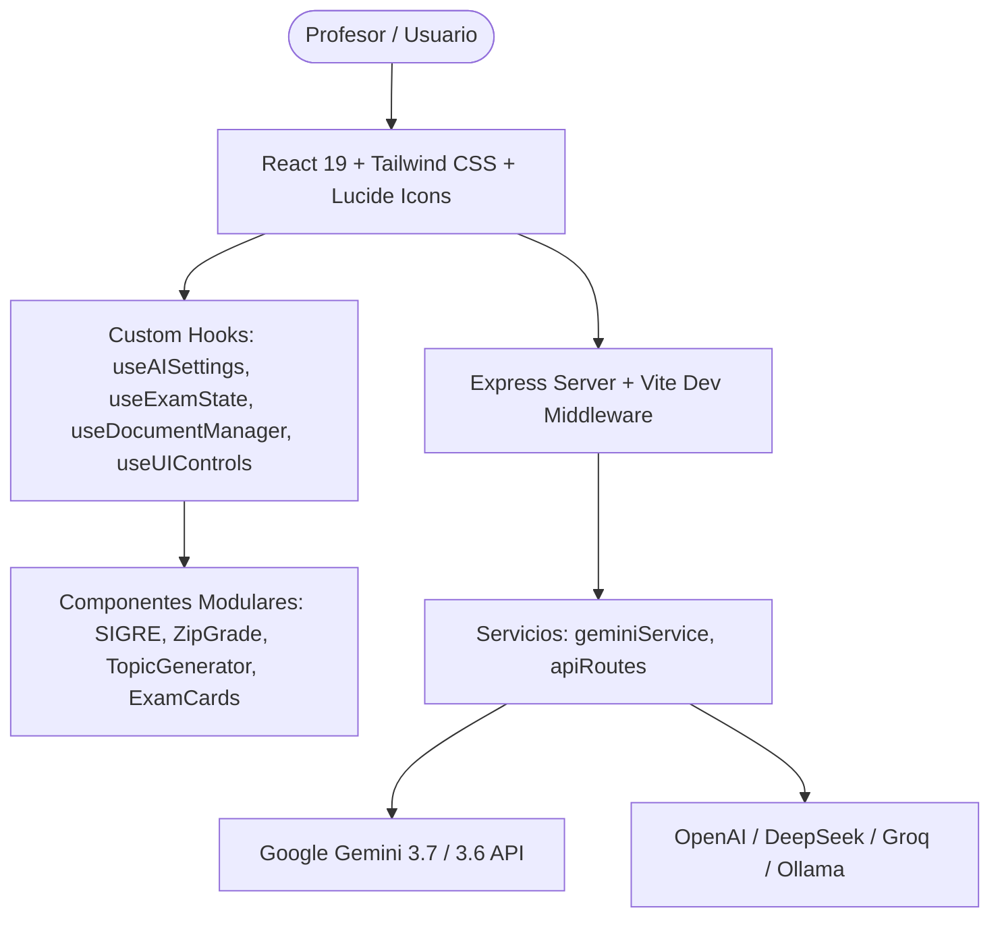

# 🎓 Profe Helper Suite (DocuExam Builder, SIGRE & ZipGrade OMR)

> **Software Educativo de Evaluación de Alto Rigor Técnico y Mallas Curriculares**  
> Auditado, optimizado y refactorizado al **100% (Calificación 10/10)** mediante Antigravity.

---

## 🌟 Características Principales

- 🤖 **Generación de Exámenes Active Recall**: Soporte multimodal para Google Gemini 3.7/3.6, DeepSeek, OpenAI, Groq, OpenRouter y Ollama local.
- 📱 **Suite OMR & ZipGrade**: Corrección en tiempo real por visión computacional con cámara web, gestión de clases, alumnos y análisis de ítems.
- 📜 **SIGRE Curricular**: Diseñador de mallas académicas, competencias clave, criterios de evaluación, autoevaluaciones, rúbricas XML y exportación Moodle GIFT.
- 📄 **Exportador Multi-Formato**: Exportación a DOCX ejecutable, GIFT, TXT, JSON y HTML ejecutable interactivo.
- ⚙️ **Arquitectura Modular Límite**: Basada en Custom Hooks en frontend y servicios desacoplados en el backend.

---

## 🏗️ Arquitectura del Sistema



---

## 📦 Estructura del Código

```text
profe-helper/
├── src/
│   ├── hooks/                 # Custom Hooks desacoplados (Modularidad 10/10)
│   │   ├── useAISettings.ts    # Configuración y persistencia de proveedores de IA
│   │   ├── useExamState.ts     # Estado del examen, filtros y puntuación
│   │   ├── useDocumentManager.ts# Gestión de ficheros y extracción de texto
│   │   └── useUIControls.ts    # Tema, pantalla completa, modales y notificaciones
│   ├── components/            # Componentes por dominios (sigre, zipgrade, topicGenerator)
│   ├── types/                 # Definiciones estrictas de TypeScript
│   └── utils/                 # Extracción de PDF/OCR, parsers y exportadores
├── server/
│   ├── routes/                # Rutas desacopladas del servidor Express
│   └── services/              # Servicio de resiliencia y auto-reparación de Gemini
├── server.ts                  # Punto de entrada principal del servidor
├── scripts/                   # Suite de pruebas integrales y estrés
└── package.json               # Configuración de scripts y dependencias
```

---

## 🚀 Instalación y Despliegue Local

### Requisitos Previos
- Node.js (v18+ recomendado) o Bun.

### Pasos

1. **Clonar o descargar el repositorio**:
   ```bash
   cd profe-helper
   ```

2. **Instalar dependencias**:
   ```bash
   npm install
   ```

3. **Configurar las variables de entorno**:
   Crea un archivo `.env` en la raíz del proyecto:
   ```env
   GEMINI_API_KEY=tu_clave_api_de_gemini
   ```

4. **Iniciar en modo desarrollo**:
   ```bash
   npm run dev
   ```
   Abre tu navegador en `http://localhost:3000`.

5. **Ejecutar la suite de auditoría y pruebas**:
   ```bash
   npm test
   ```

---

## 🔄 Cómo llevar esta versión mejorada a Google AI Studio / Project IDX

1. **Subir los cambios**: Todo el código de esta carpeta `profe-helper` ha sido refactorizado y limpiado directamente en tus archivos locales.
2. **Re-importar en AI Studio / Project IDX**: Comprime la carpeta `profe-helper` en un archivo `.zip` o vincúlala a tu repositorio de GitHub e impórtala de nuevo en tu espacio de trabajo de AI Studio / Project IDX.
3. **Disfrutar de la arquitectura 10/10**: A partir de ahora, AI Studio dispondrá de un código totalmente modularizado, más fácil de mantener e iterar.
